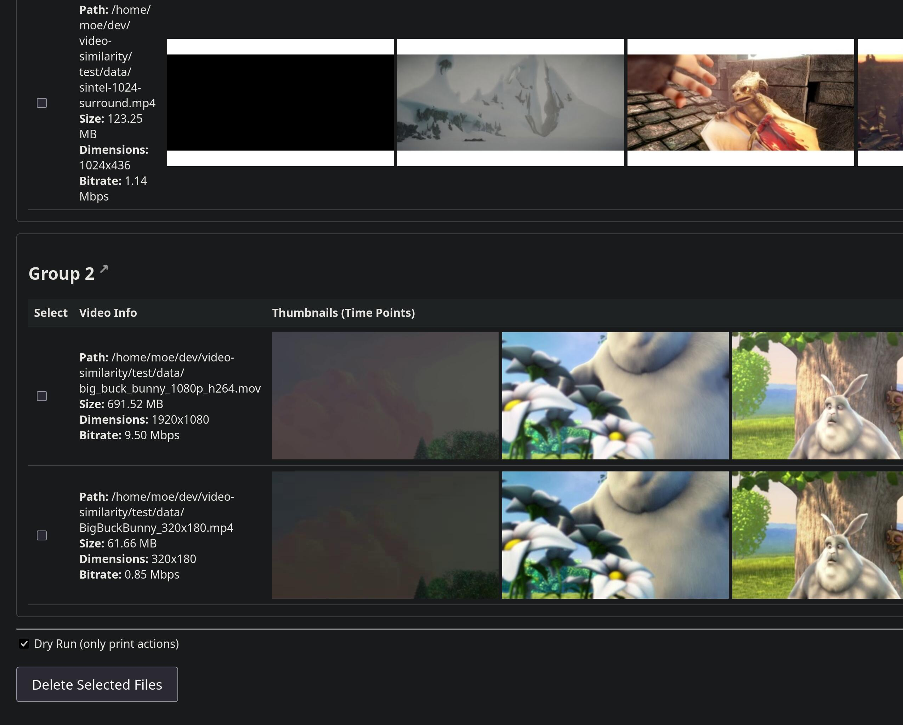
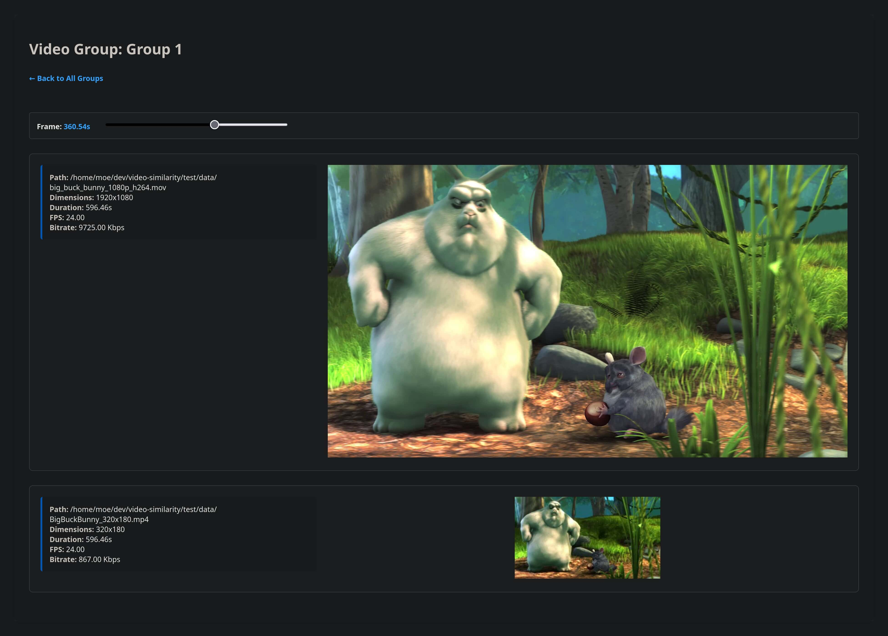

# Czkawka companion tool: Video similarity visualization

This project provides a tool to visualize video similarity reports generated by [Czkawka](https://github.com/qarmin/czkawka): A report generated `czkawka_cli video` command is displayed as thumbnail strips and the user can check which videos should be deleted.

Overview of all report entries:



Group details with time scrubber:


## Project Setup

Prerequisites:
- [uv](https://docs.astral.sh/uv/) (for dependency and project management)
- Recommended: pre-commit

Installation:
1. **Clone the repository:**
   ```sh
   git clone https://github.com/mostlyuseful/video-similarity.git
   cd video-similarity
   ```

2. **Create a virtual environment and install dependencies:**
   ```sh
   uv sync
   ```

## Usage

Generate a video duplication report using czkawka:

```shell
czkawka_cli video --delete-method NONE -p results.json --tolerance 10 --minimal-file-size 30000000 -d <directory> -d <directory>
```

Then run the video similarity visualization:

```shell
uv run video-similarity --report <path/to/results.json>
```
